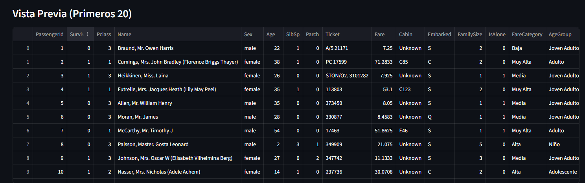
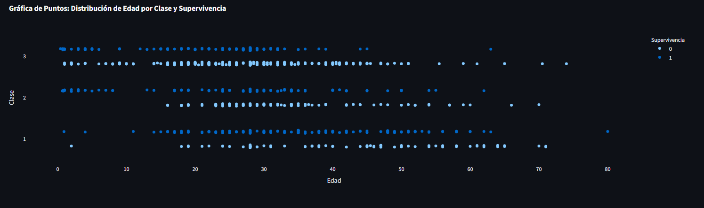
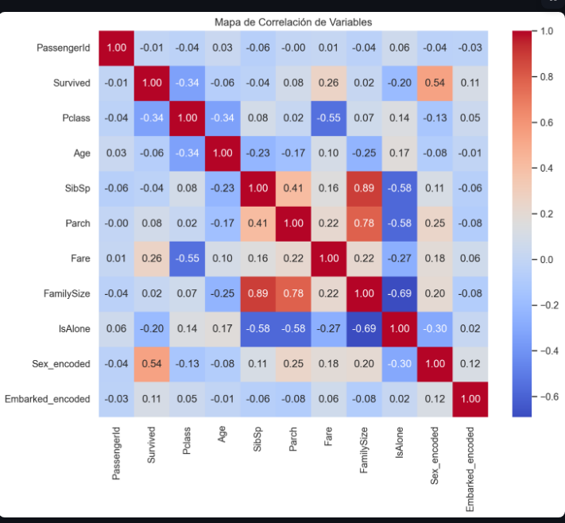
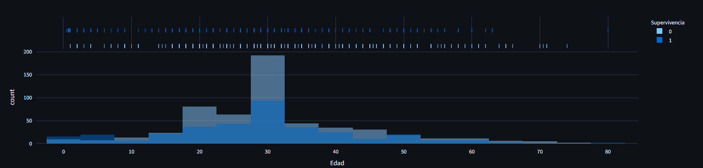

# Presentación Interactiva del Titanic

Este proyecto es una plataforma interactiva histórica diseñada para exponer las estadísticas y el contexto detrás de los pasajeros del Titanic. Ha sido optimizada especialmente para ser presentada ante un público general, brindando una experiencia inmersiva sin distracciones de jerga técnica.

---

## Características Principales

- **Información General:** Métricas instantáneas de los pasajeros, incluyendo tasas de supervivencia, promedios de edad y tarifas.
- **Flujo Global de Pasajeros:** Una visualización de alto nivel que rastrea a las agrupaciones de pasajeros desde su embarque y clase social, hasta saber si lograron sobrevivir.
- **Explorador Gráfico:** Representaciones visuales claras de la historia, incluyendo gráficas estéticas de tendencia de edades, distribuciones por nivel económico y gráficos de puntos estratificados.
- **Buscador Histórico:** Un motor de búsqueda directo donde puedes colocar nombres (ej. Jack, Rose) para verificar si estuvieron a bordo y cuál fue su destino final.
- **Simulador de Supervivencia:** Una herramienta en la que los espectadores pueden ingresar sus datos personales (edad, género, clase y acompañantes) y el sistema calculará históricamente si hubiesen sobrevivido a la tragedia, mostrando un desglose detallado.

---

## Visuales Destacados

### Análisis de Supervivencia por Edad y Clase
Comprender quién se salvó requiere analizar cómo interactuaron la clase social y la edad durante la evacuación.

### Gráficas de Tendencia
Identificación rápida de las posibilidades de supervivencia a lo largo del rango de años, con marcadores visuales clave contrastante al promedio.

### Simulación Personalizada
El sistema muestra de manera sencilla las ventajas y desventajas que habría tenido tu propio perfil durante la noche del hundimiento naval.

---

## Diseño y Entorno de la Presentación

La plataforma ha sido rediseñada enfocándose en entregar el mejor impacto visual durante la exhibición:
- **Tema Premium ('Dark Mode'):** Toda la interfaz y sus gráficos han sido unificadas bajo un diseño oscuro y estilo "cristal" (glassmorphism) que facilita la concentración de la audiencia.
- **Lectura Fácil:** Transición de variables estadísticas estructuradas hacia preguntas simples y respuestas detalladas en español convencional.
- **Lógica Invisible:** Todo el procesamiento matemático complejo, el análisis cruzado y las imputaciones, ahora se realizan internamente; la audiencia solo visualizará los resultados concisos.

---
*Transformando un conjunto de datos histórico crudo en una exhibición interactiva y accesible.*
